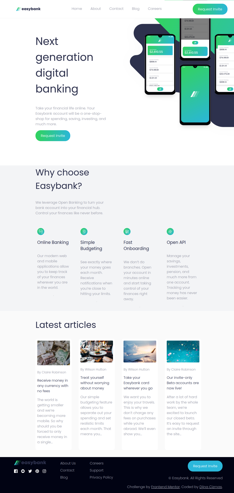

# Simple React Web Page  

This simple web page showcases the knowledge I acquired through a React course. It represents my first project built with React, focusing on component-based development and responsive design. 

_All resources for this project, including the design, were taken as a challenge from [Frontend Mentor](https://www.frontendmentor.io/)._ 

## Preview  

Here is a screenshot of the project:  

  
 
## Installation
For installation and setup instructions, check the [internal README](./learning-react-vite/README.md).  

### Remarks and Considerations
---
**Note:** Although the webpage includes links, they are non-functional for this project, as it is based on a challenge from Frontend Mentor. 

**Note:** While I recognize that there are potentially more efficient ways to handle the responsive design, I opted for this approach as part of the learning process. I'm aware that there are optimizations that could be made, and I look forward to improving this in future iterations and future projects.
